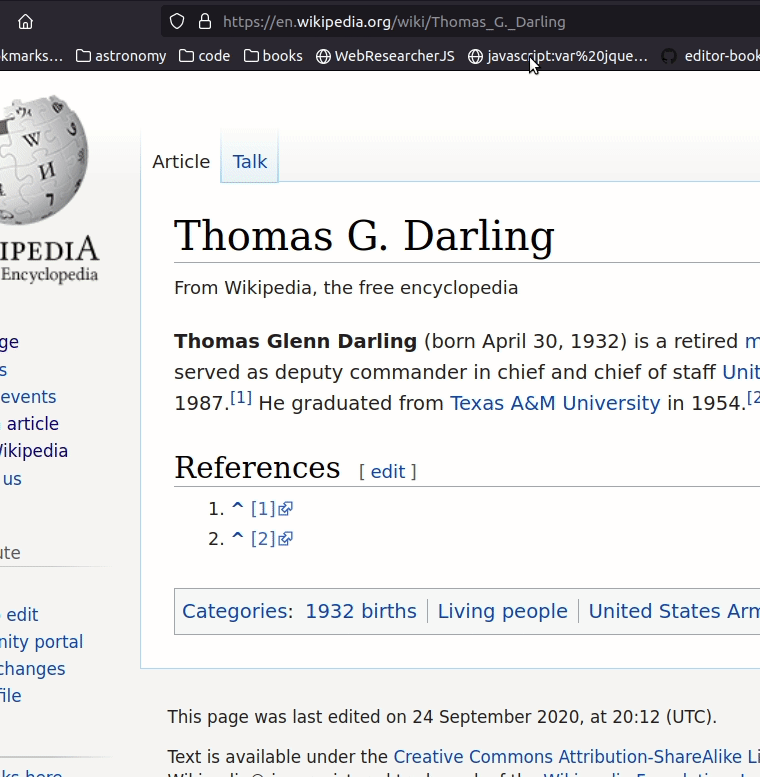

#  WebResearcherJS


> One of the challenges in parsing information from the internet is that we oftentimes are unable to retain it later. But if we pro-actively engage in the content by taking notes, that might change.

WebResearcher is a simple web annotation tool written in javascript that lets you annotate a webpage, store your annotations locally and load them up again later. It also lets multiple users collaboratively share notes via a mqtt-server.


### Installation

Create a bookmarklet using the code available under bookmarklet/editor-bookmarklet and you are good to go! 


### Controls 



Load bookmarklet on the webpage you would like to annotate and select some region in the webpage. 
- **Ctrl + 1**: Create note near selection
  - Hold on the shift key and drag the note anywhere on the webpage
  - Resize as needed
  - Right click on any note to destroy it.
- **Ctrl + 2**: Save all annotations in current webpage as .txt to local drive
- **Ctrl + 3**: Load annotations from local drive
- **Ctrl + 4**: Initialize a mqtt-server to share notes
  - Once a mqtt-server is setup, each note has a "Send note via mqtt" button which upon clicking, will transmit these notes.

### Video demo
Basic Features: <https://www.youtube.com/watch?v=WVO_9tetbGs>

Sharing notes with mqtt: <https://www.youtube.com/watch?v=SiJrbFewctw>

Searching notes using searchmonkey: <https://www.youtube.com/watch?v=WsbTZe0hBM4>

---

### Custom builds
If you want to make a version with different controls, you can certainly do so by editing the values for the following variables in editor.js

```
var createNoteKeyCode = 49 ;  // corresponds to 1 on keyboard
  
var saveAnnotationsKeyCode= 50; // corresponds to 2 on keyboard
  
var loadAnnotationsKeyCode=51 ; // corresponds to 3 on keyboard
  
var startmqttKeyCode=52 ; // corresponds to 4 on keyboard

// controls the specs of the notes

var defaultNoteColor = "#ffffcc";

var defaultFont= "13px";

var defaultOpacity = "80%";

```

And copying the contents of this updated editor.js and making yourself a bookmarklet here: <https://caiorss.github.io/bookmarklet-maker/>. 
There are also several changes that you can make to the pell text-editor (e.g., add a button which turns text to a heading). In editor.js these are under pell.init().


***
#### Useful resources


How to add bookmarklet?
<https://mreidsma.github.io/bookmarklets/installing.html>

How to convert javascript code to bookmarklet:
<https://caiorss.github.io/bookmarklet-maker/>

How to convert bookmarklet to chrome extension
<https://github.com/legierski/bookmarklet-to-extension>


***

#### JS modules that this tool uses
- jQuery: https://jquery.com/
- jQuery-UI: https://jqueryui.com/
- Pell: https://github.com/jaredreich/pell
- paho-mqtt: https://github.com/eclipse/paho.mqtt.javascript
- Notify: https://notifyjs.jpillora.com/


