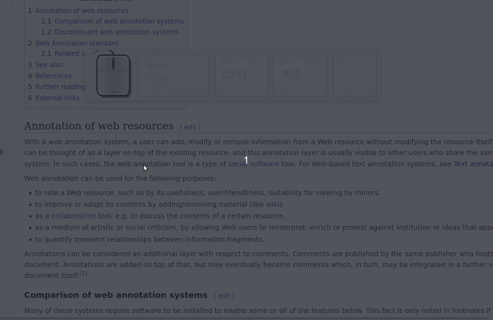

# WebReseacherJS 

### Installation

Create a bookmarklet using the code available under bookmarklet/editor-bookmarklet and you are good to go! (How to add bookmarklet? : https://mreidsma.github.io/bookmarklets/installing.html)

### Features demo

https://youtu.be/Uc407sSpAA4

### Controls

- Tilde (~) : Set anchor 
- 1 : Make annotation near anchor
- Right click on any note to destroy it.
- 2 : Save all annotations in current webpage as .txt to local drive
- 3 : Load annotations from local drive
- 4 : Initialize a mqtt-server.
- Once a mqtt-server is setup, each note has a "Send note via mqtt" button which upon clicking, will transmit these notes.
